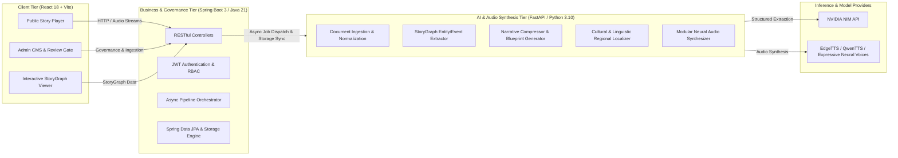

# StoryBridge — AI-Powered Cross-Language Story Adaptation & Narration Platform

[](https://spring.io/projects/spring-boot)
[](https://openjdk.org/)
[](https://fastapi.tiangolo.com/)
[](https://www.python.org/)
[](https://reactjs.org/)
[](https://vitejs.dev/)
[](https://tailwindcss.com/)
[](https://www.nvidia.com/en-us/ai-data-science/products/nim/)

> **StoryBridge** is an enterprise-grade AI storytelling ecosystem that transforms raw, unstructured literary works into rich, structured **Story Graphs**, compresses them into multi-duration narratives (Quick, Standard, Complete), localizes them into regional Indian languages (Hindi, authentic Marathi, etc.), and synthesizes expressive, studio-grade multi-chapter audiobooks.

---

## 📑 Table of Contents

- [System Architecture](#-system-architecture)
- [Key Features](#-key-features)
- [Tech Stack](#-tech-stack)
- [Project Directory Structure](#-project-directory-structure)
- [Getting Started](#-getting-started)
  - [Prerequisites](#prerequisites)
  - [1. Environment Setup](#1-environment-setup)
  - [2. Running the AI Engine (Python)](#2-running-the-ai-engine-python)
  - [3. Running the Backend (Spring Boot)](#3-running-the-backend-spring-boot)
  - [4. Running the Frontend (React + Vite)](#4-running-the-frontend-react--vite)
- [Docker & Containerized Deployment](#-docker--containerized-deployment)
- [Demo Credentials](#-demo-credentials)
- [Artifact Storage Hierarchy](#-artifact-storage-hierarchy)
- [Quality Assurance & Testing](#-quality-assurance--testing)
- [License](#-license)

---

## 🏛 System Architecture

StoryBridge operates on a decoupled 3-tier microservices architecture:



---

## ✨ Key Features

1. **Multi-Source Ingestion & Extraction**:
   - Ingests Raw Text, Markdown, PDF (PyMuPDF), EPUB, Web URLs, and Subtitles (SRT/VTT).
   - Generates SHA-256 checksums and validates Public Domain rights records.
2. **Canonical StoryGraph Engine**:
   - Extracts characters/entities, events, chronological timeline, causal relationships, and emotional arcs.
   - Powers interactive 2D graph visualizations.
3. **Adaptive Narrative Compression**:
   - Generates 3 duration presets: **Quick** (~5m), **Standard** (~15m), and **Complete** (~45m).
   - Dynamic blueprinting maintains narrative integrity across compression ratios.
4. **Cultural Indian Language Localization**:
   - High-fidelity cultural adaptation into **Hindi (हिंदी)** and **authentic Marathi (मराठी)**.
   - Differentiates dialect semantics and entity transliterations (e.g., *माकड आणि लाकडी पाचर*).
5. **Modular Studio-Grade Neural TTS**:
   - Pluggable TTS architecture supporting EdgeTTS, QwenTTS, ElevenLabs, and OpenAI Audio.
   - Expressive neural voices (`hi-IN-MadhurNeural`, `mr-IN-AarohiNeural`, `en-US-ChristopherNeural`).
   - Clean audio chunking with automatic metadata generation.
6. **Enterprise Governance & Review Gate**:
   - Four-eyes review workflow: Draft -> Processing -> Human Review Gate -> Published.
   - Comprehensive QA scores across Source, StoryGraph, Localization, and Audio.

---

## 🛠 Tech Stack

| Component | Technologies |
| :--- | :--- |
| **Frontend** | React 18, TypeScript, Vite, TailwindCSS, Lucide Icons, Axios, React Router 6 |
| **Backend** | Java 21, Spring Boot 3.3.3, Spring Security (JWT), Spring Data JPA, H2 / PostgreSQL, Lombok |
| **AI Engine** | Python 3.10+, FastAPI, Pydantic v2, PyMuPDF, Trafilatura, NetworkX, Uvicorn, PyTest |
| **Inference Models** | NVIDIA NIM API (`google/diffusiongemma-26b-a4b-it`, `meta/llama-3.3-70b-instruct`) |
| **Speech Engine** | Modular Neural TTS (EdgeTTS, QwenTTS-ready, OpenAI TTS, ElevenLabs) |
| **Storage & Infra** | Filesystem Artifact Store, S3/MinIO compatible, Docker & Docker Compose |

---

## 📂 Project Directory Structure

```text
StoryBridge/
├── ai-engine/                  # Python FastAPI AI Inference & TTS Service
│   ├── compression/            # Narrative Blueprint & Compression Generators
│   ├── extraction/             # Story Graph & Entity/Event Extractors
│   ├── ingestion/              # Multi-format Source Document Adapters
│   ├── localization/           # Hindi & Marathi Cultural Localizers
│   ├── providers/              # NVIDIA NIM LLM & Modular TTS Providers
│   ├── qa/                     # Automated Multi-stage QA Evaluators
│   ├── schemas/                # Canonical Pydantic Schemas
│   ├── tts/                    # Chapter Audio Synthesizer
│   ├── app.py                  # FastAPI Application Entrypoint
│   ├── pipeline.py             # Master End-to-End Orchestrator
│   └── Dockerfile              # AI Engine Container Spec
├── backend/                    # Spring Boot 3 Java Governance Backend
│   ├── src/main/java/          # Controllers, Services, Entities, Repositories
│   ├── src/main/resources/     # application.yml & config
│   ├── pom.xml                 # Maven Build Configuration
│   └── Dockerfile              # Backend Multi-stage Container Spec
├── frontend/                   # React 18 + Vite Web Application
│   ├── src/components/         # Audio Player, StoryGraph, Review Gate, Modals
│   ├── src/pages/              # Discovery Catalog, Story Detail, Admin CMS, Login
│   ├── src/services/           # Axios API Client & Authentication State
│   ├── vite.config.ts          # Vite Configuration & API Proxy
│   └── Dockerfile              # Frontend Production Nginx Spec
├── storage/artifacts/          # Local Artifact Store (StoryGraphs, Scripts, MP3s)
│   └── story_panchatantra_monkey_wedge/ # Pre-seeded Demo Story
├── docker-compose.yml          # Full-stack Multi-service Compose File
├── .env.example                # Sample Environment Template
└── README.md                   # Project Documentation
```

---

## 🚀 Getting Started

### Prerequisites
- **Java**: JDK 21+ installed and on `PATH`
- **Maven**: 3.9+ (`mvn`)
- **Python**: 3.10+ and `pip`
- **Node.js**: 18+ and `npm`

---

### 1. Environment Setup

Copy `.env.example` to `.env` in the project root and configure your NVIDIA NIM API key:

```bash
cp .env.example .env
```

Edit `.env`:
```ini
NVIDIA_API_KEY=nvapi-your_actual_key_here
NIM_BASE_URL=https://integrate.api.nvidia.com/v1
NIM_MODEL_NAME=google/diffusiongemma-26b-a4b-it
```

---

### 2. Running the AI Engine (Python)

```bash
cd ai-engine
pip install -r requirements.txt
python -m uvicorn app:app --host 0.0.0.0 --port 8000 --reload
```
*Health endpoint: `http://localhost:8000/api/v1/health`*

---

### 3. Running the Backend (Spring Boot)

```bash
cd backend
mvn spring-boot:run
```
*Backend API: `http://localhost:8080`*

---

### 4. Running the Frontend (React + Vite)

```bash
cd frontend
npm install
npm run dev
```
*Frontend Web App: `http://localhost:3000`*

---

## 🐳 Docker & Containerized Deployment

To start all microservices (AI Engine, Backend, Frontend, Postgres, RabbitMQ, MinIO) simultaneously:

```bash
docker compose up --build
```

Access services:
- **Web Application**: `http://localhost:3000`
- **Backend API**: `http://localhost:8080`
- **AI Engine API**: `http://localhost:8000`
- **MinIO Console**: `http://localhost:9001` (User: `minioadmin` / Pass: `minioadmin`)

---

## 🔐 Demo Credentials

The platform comes pre-seeded with three default RBAC roles:

| Role | Username | Password | Permissions |
| :--- | :--- | :--- | :--- |
| **Administrator** | `admin` | `admin123` | Full Access, Story Ingestion, Pipeline Trigger, User Management |
| **Reviewer** | `reviewer` | `reviewer123` | Review Gate, QA Approvals, Publish Stories |
| **Consumer** | `demo` | `demo123` | Story Discovery, Audio Streaming, StoryGraph Explorer |

---

## 📦 Artifact Storage Hierarchy

All story assets are organized per the specification under `storage/artifacts/<story_id>/`:

```text
storage/artifacts/story_panchatantra_monkey_wedge/
├── source/
│   ├── metadata.json           # Ingestion metadata & SHA-256
│   └── rights.json             # Public Domain verification
├── normalized/
│   ├── canonical_source.json   # Parsed paragraphs & segments
│   └── qa.json                 # Source QA report
├── understanding/
│   ├── story_graph.json        # Nodes, Edges, Timeline, Characters
│   ├── entities.json           # Extracted entity definitions
│   └── qa.json                 # StoryGraph consistency QA
├── narrative/
│   ├── blueprint_quick.json    # Scene selection blueprint (~5m)
│   ├── quick.json              # Canonical Master Narrative (English)
│   └── standard.json           # Canonical Master Narrative (~15m)
├── localization/
│   ├── hi/quick/script.json    # Hindi localized chapter script
│   └── mr/quick/script.json    # Authentic Marathi localized script
└── audio/
    ├── hi/quick/               # Hindi Neural Audio MP3s (ch01.mp3, ch02.mp3, ...)
    └── mr/quick/               # Authentic Marathi Neural Audio MP3s
```

---

## 🧪 Quality Assurance & Testing

Run AI Engine tests:
```bash
python -m pytest ai-engine/tests
```

Run Backend unit & integration tests:
```bash
cd backend
mvn test
```

Run Frontend production build check:
```bash
cd frontend
npm run build
```

---

## 📜 License

This project is licensed under the **MIT License**.
See [StoryBridge_SRS.md](StoryBridge_SRS.md) for full architectural specifications.
